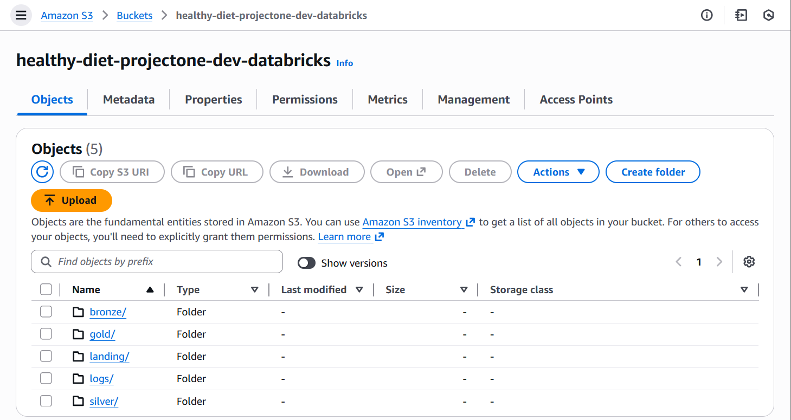
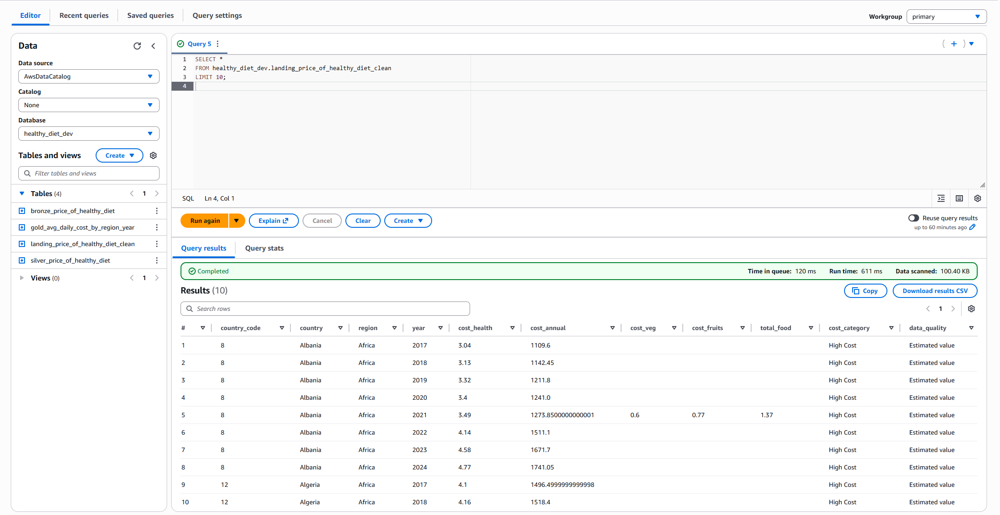
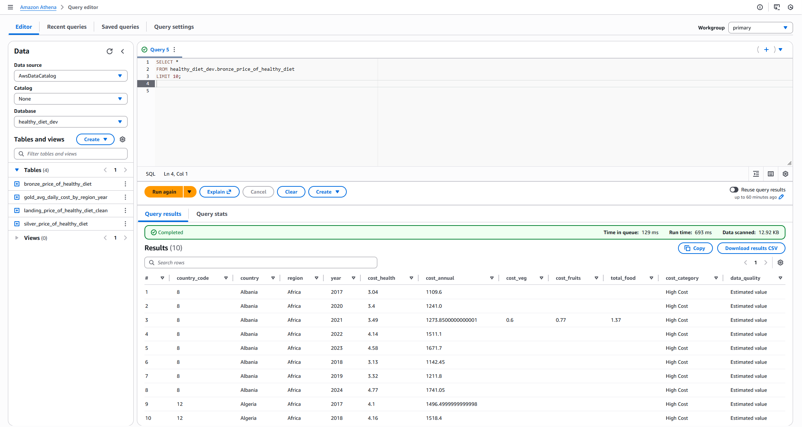
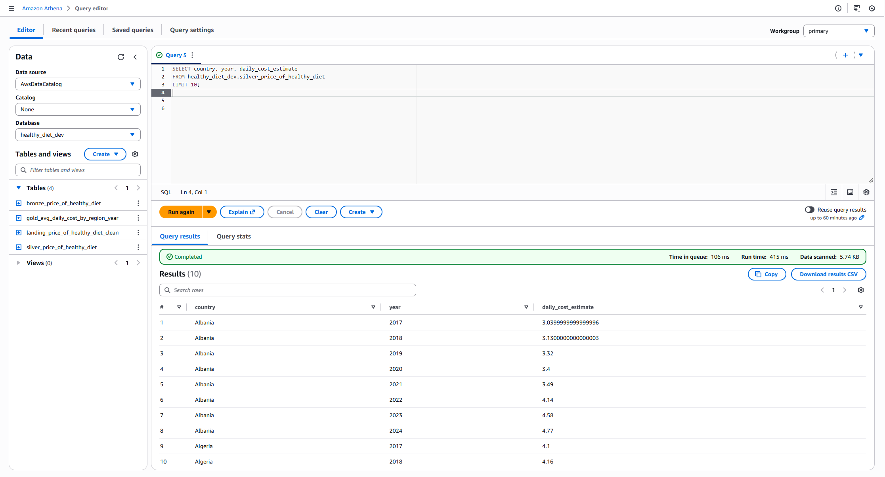
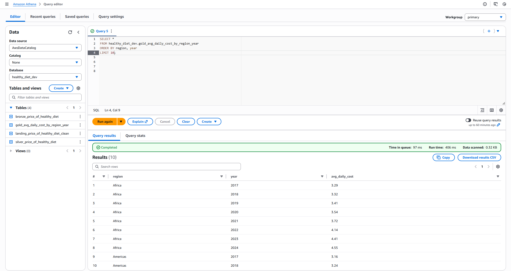
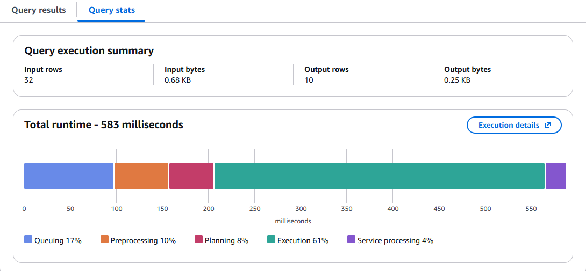

# AWS Athena Healthy Diet Pipeline

This project demonstrates an end-to-end batch data pipeline built on AWS using
Amazon S3, Amazon Athena, and a layered data lake architecture.

## Architecture
CSV data is ingested into S3 and processed through the following layers:

- Landing: Raw CSV ingestion
- Bronze: Typed Parquet conversion
- Silver: Business rules and derived metrics
- Gold: Aggregated analytics-ready insights

## Technologies Used
- Amazon S3
- Amazon Athena
- AWS Glue Data Catalog
- SQL (CTAS)

## Business Question
What is the average daily cost of a healthy diet by region and year?

## Output
The final Gold table provides aggregated daily cost metrics by region and year,
ready for analytics and reporting.

## Screenshots

### S3 Folder Structure

### Landing (CSV)

### Bronze (Parquet + types)

### Silver (Business rule + derived column)

### Gold (Insight table)

### Query Stats (low scan)

